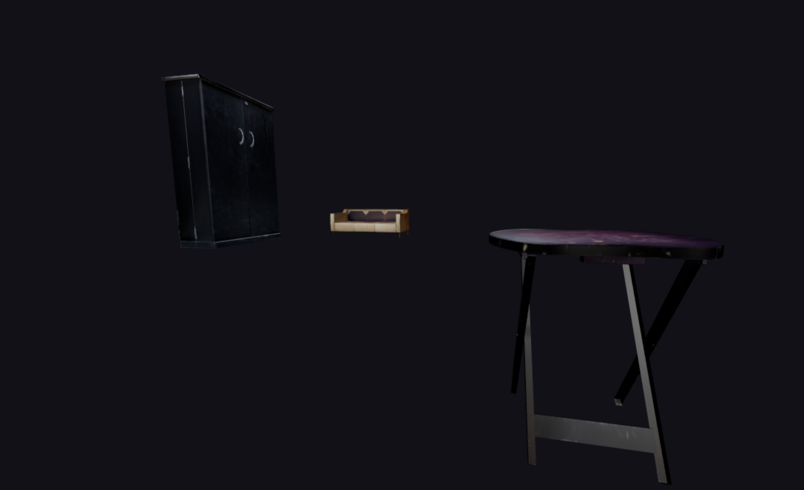

# Local 3D Viewer



A simple, configurable 3D model viewer for local OBJ/MTL/PLY/FBX files, built with Three.js. Easily preview and explore your 3D assets in the browser.

## Features
- Load and view OBJ, MTL, PLY, and FBX models from the `models/` directory
- Tunable scene parameters (camera, lighting, floor, scatter, etc.) via `tunables.js`
- Supports multiple models and textures
- Simple, modern UI

## Getting Started

1. **Clone this repository:**
   ```sh
   git clone <your-repo-url>
   cd local3dviewer
   ```
2. **Add your models:**
   - Place your OBJ, MTL, PLY, or FBX files in the `models/` folder.
   - Update `tunables.js` to add your models to the `modelList` array if needed.
3. **Open in browser:**
   - Open `index.html` directly in your browser (no build step required).

## File Structure
- `index.html` — Main HTML file
- `app.js` — Main application logic
- `tunables.js` — Scene and model configuration
- `jsm/loaders/` — Three.js loaders for OBJ, MTL, PLY
- `models/` — Your 3D models and textures

## Configuration
Edit `tunables.js` to adjust:
- Model list and folder
- Camera settings (FOV, position, pan)
- Floor size, color, roughness
- Lighting (key, fill, back, ambient)
- Model scatter range

## Example Model Entry
```js
modelList: [
  { name: "model1", exts: ["obj"] },
  { name: "model2", exts: ["obj"] },
  { name: "model3", exts: ["obj"] },
],
```

## License
MIT
